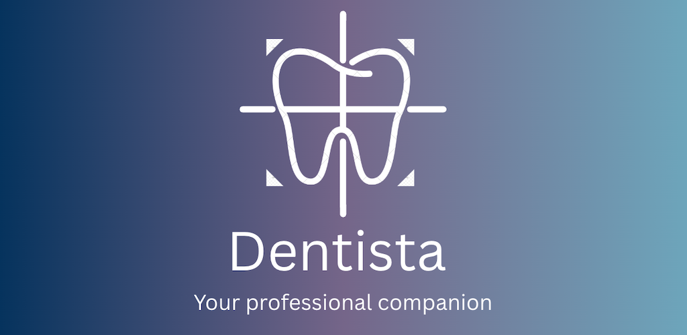

# Dentista Photo

A professional dental photography application designed for dentists, orthodontists, and dental specialists to capture, manage, and analyze patient oral health images.

## Overview

Dentista Photo provides a streamlined platform for dental professionals to document patient treatments, track progress, and enhance patient communication through high-quality dental photography. The application allows for systematic image organization, comparison, and sharing capabilities while maintaining HIPAA compliance.

## Features

- Professional dental photo capture with guided positioning
- Patient case management and organization
- Before/after treatment comparisons
- Secure image storage and backup

## Download

You can download the latest version of Dentista Photo from our official website:

[Download Dentista Photo](https://dentista-apps.com/index.html#download)

## Installation

1. Download the application from the link above
2. Run the installer and follow the on-screen instructions
3. Launch Dentista Photo and complete the initial setup

## System Requirements

- iOS 15.6 or later
- Compatible with iPhone and iPad
- Android 9.0 (Pie) or later
- Internet connection required for cloud features

## Support

For technical support, please visit [our support page](https://dentista-apps.com/) or contact support@dentistaphoto.com.

## License

Dentista Photo is licensed under [proprietary license](https://dentista-apps.com/).